## 3. THIẾT KẾ

### 3.1. Activity Diagram

#### 3.1.1. Activity đăng ký

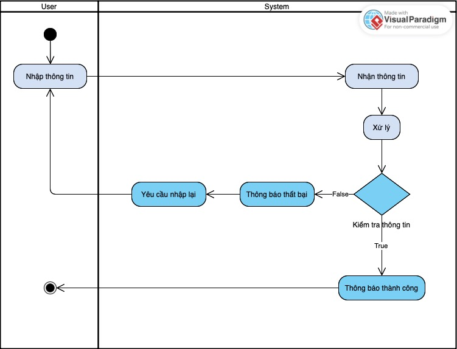

#### 3.1.2. Activity đăng nhập

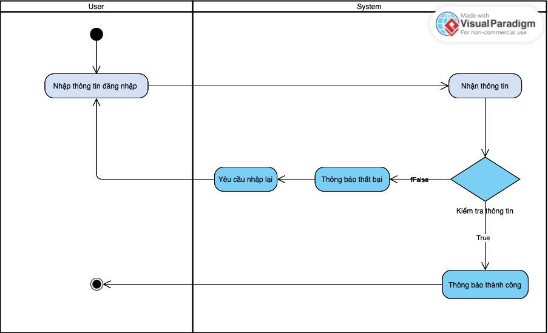

#### 3.1.3. Activity thay đổi mật khẩu

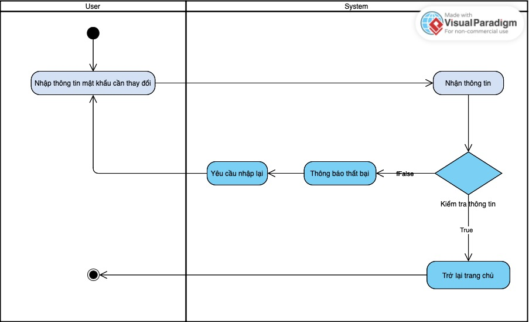

#### 3.1.4. Activity hiển thị translation subtitle

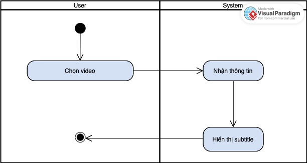

#### 3.1.5. Activity sử dụng chatbot

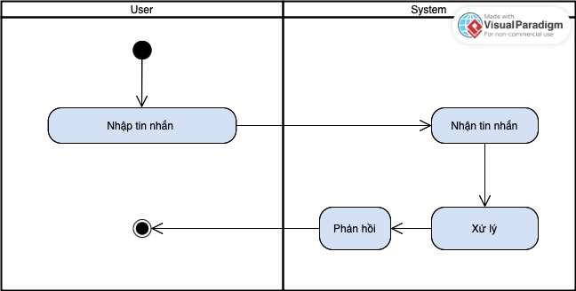

### 3.2. ER Diagram

#### 3.2.1 ER Diagram đăng ký

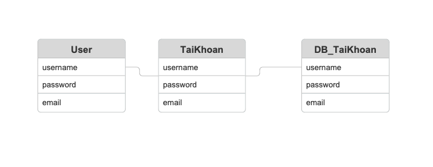

#### 3.2.2 ER Diagram đăng nhập

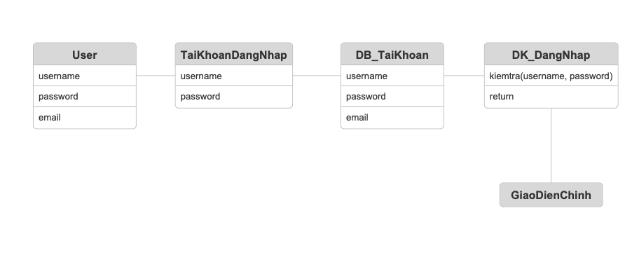

#### 3.2.3 ER Diagram thay đổi mật khẩu

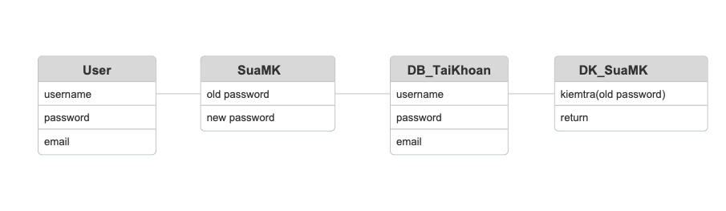

#### 3.2.4 ER Diagram hiển thị translation subtitle

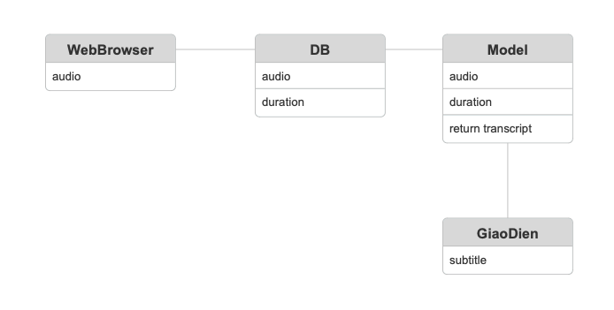

#### 3.2.5 ER Diagram sử dụng chatbot

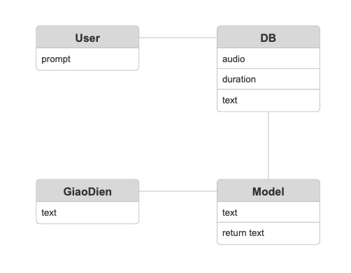

### 3.3. Database Diagram

Sơ đồ trên Hệ quản trị CSDL
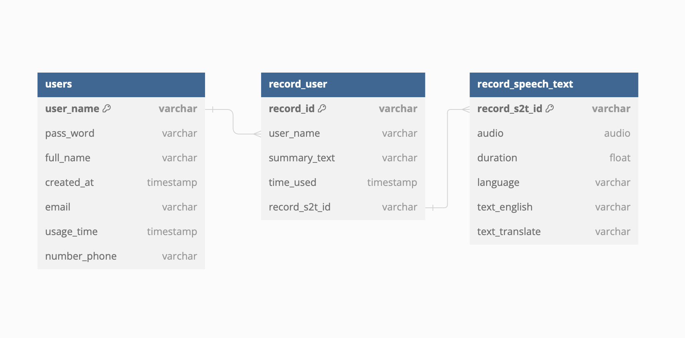

### 3.4. Screen flow

Sơ đồ phân luồng màn hình ứng dụng

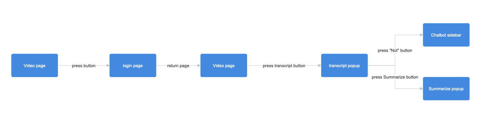
